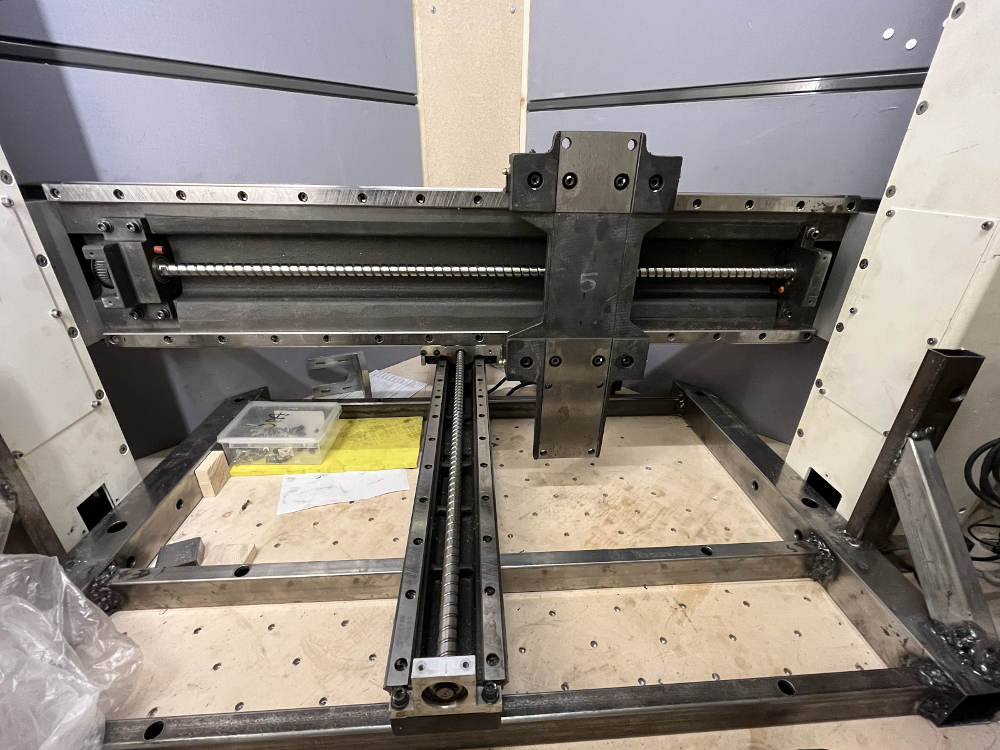

Sergei 2 CNC machine project
============================

This repository contains design files for Hacklab Jyväskylä's CNC machine project.
The machine is built out of existing linear assemblies that have been donated to us, and as such it is not readily reproducible. But some of the modules may be useful and in any case this repository contains information for future maintenance of the machine.

The machine design is a compromise between router and mill designs.
In general router-type CNC machines are more useful for our typical projects, as they have larger work area for flat stock.
But in the same time it would be desirable for the machine to be sturdy enough to cut mild steel at reasonable speeds.

The basic design is similar to fixed gantry routers or a portal milling machine.
X axis ballscrew assembly moves up and down on two Z axis columns.
Y axis moves the table.

